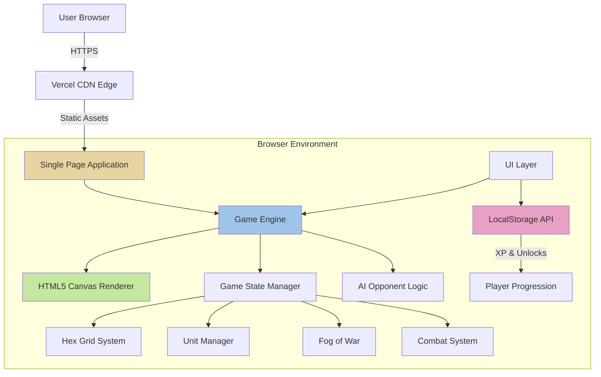
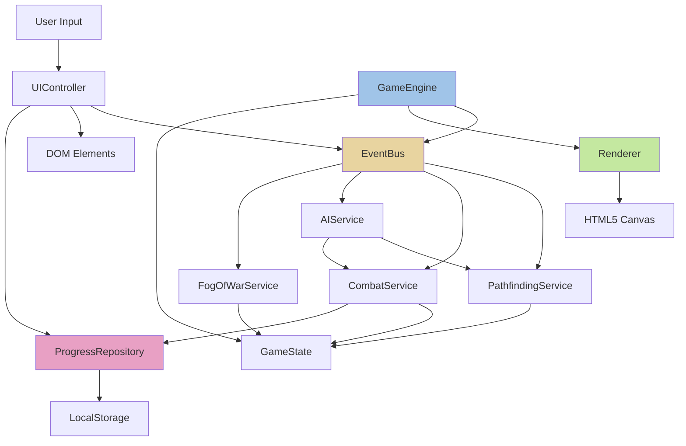
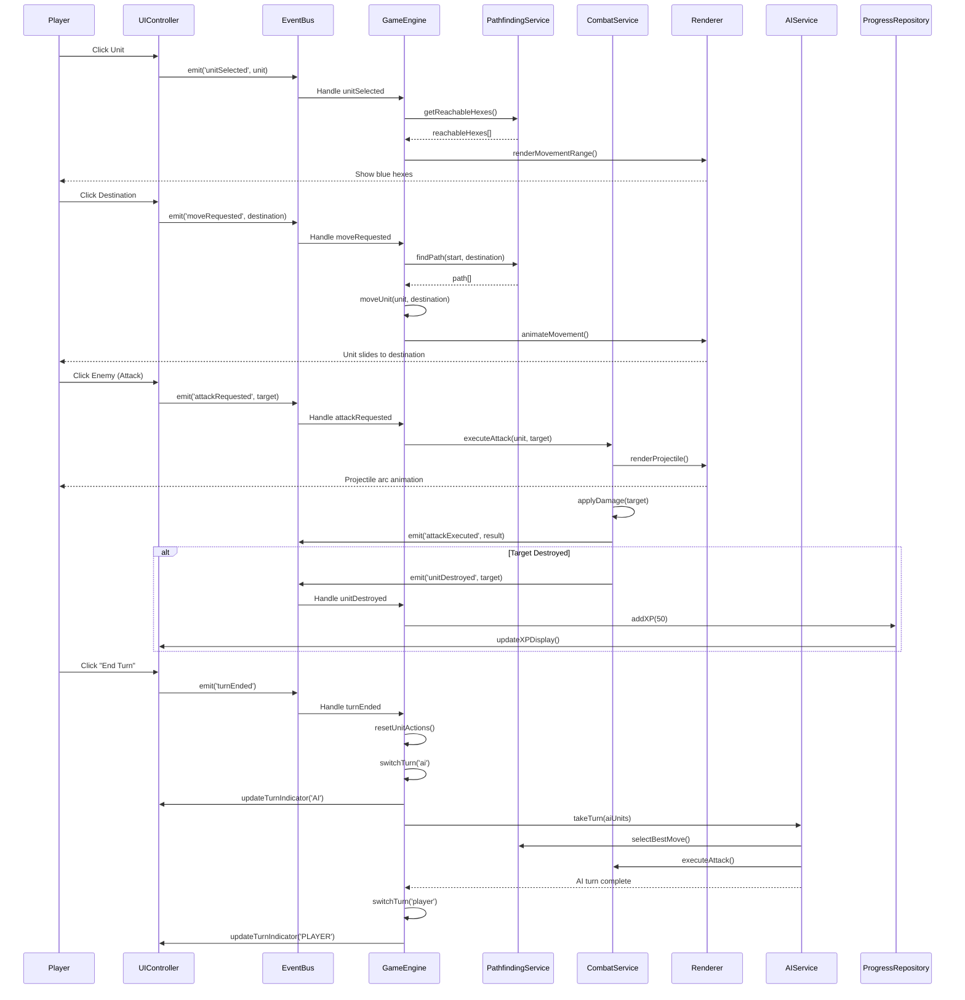
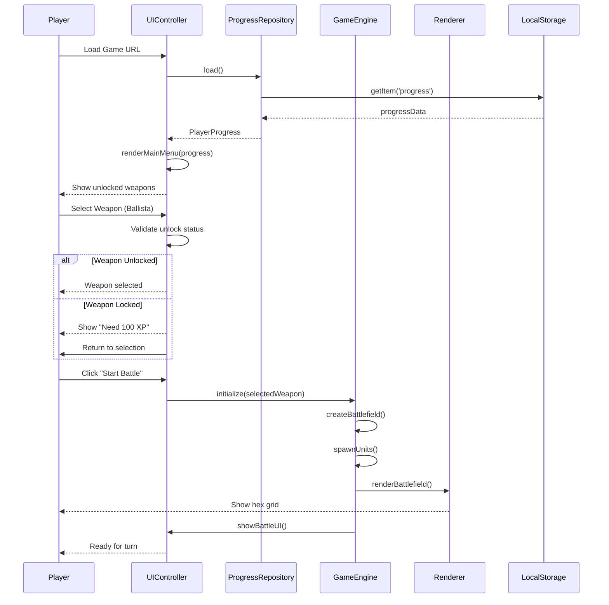
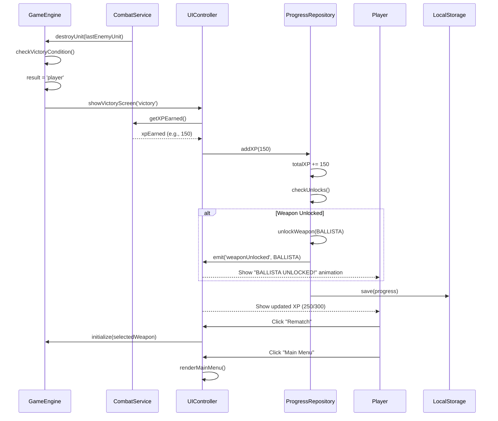

# Siege Tactics Fullstack Architecture Document

**Version:** 1.0  
**Date:** November 21, 2025  
**Document Owner:** Winston (Architect)

---

## Introduction

This document outlines the complete fullstack architecture for **Siege Tactics**, including backend systems, frontend implementation, and their integration. It serves as the single source of truth for AI-driven development, ensuring consistency across the entire technology stack.

This unified approach combines what would traditionally be separate backend and frontend architecture documents, streamlining the development process for modern fullstack applications where these concerns are increasingly intertwined.

### Starter Template or Existing Project

**N/A - Greenfield project**

This is a greenfield browser-based game developed for a 5-hour hackathon. No starter templates or existing codebases are being used. The project will be built from scratch with a focus on rapid development and tactical game mechanics.

### Change Log

| Date | Version | Description | Author |
|------|---------|-------------|--------|
| 2025-11-21 | 1.0 | Initial architecture document created | Winston (Architect) |

---

## High Level Architecture

### Technical Summary

Siege Tactics employs a **client-side single-page application (SPA) architecture** built entirely in the browser with no backend infrastructure required. The game uses **vanilla TypeScript with HTML5 Canvas rendering** for the hex-grid battlefield, providing direct control over game loop performance and rendering optimization. State management is handled through a simple **reactive state pattern** using TypeScript classes and event emitters. The frontend framework-less approach eliminates build complexity and dependency overhead, critical for the 5-hour development constraint. **LocalStorage API** handles XP progression and weapon unlock persistence between sessions. This architecture achieves the PRD goals of rapid development, browser-native gameplay, and tactical hex-grid mechanics while maintaining 60fps performance on modern hardware.

### Platform and Infrastructure Choice

**Platform:** Vercel (static hosting)  
**Key Services:** Static file hosting, CDN edge network  
**Deployment Host and Regions:** Global CDN (automatic edge distribution)

**Rationale:** 
- Vercel provides instant deployment from git repository with zero configuration
- Perfect for TypeScript/Canvas SPAs with automatic build detection
- Free tier sufficient for hackathon judging traffic
- Can deploy multiple times during development for testing
- Takes <5 minutes to set up, leaving maximum time for game development

**Alternative Options Considered:**
- **AWS S3 + CloudFront:** More setup overhead (20-30 min), overkill for hackathon
- **GitHub Pages:** Viable but less optimized build pipeline than Vercel

### Repository Structure

**Structure:** Monorepo (single repository, minimal package separation)

**Monorepo Tool:** None (lightweight structure without monorepo tooling overhead)

**Package Organization:** Single-package approach with clear directory separation by concern

**Rationale:**
- For a 5-hour project, monorepo tooling (Nx, Turborepo) adds unnecessary complexity
- All code is client-side TypeScript - no frontend/backend split needed
- Simple folder structure by feature (game-logic, rendering, ui) is sufficient
- Can be refactored to multi-package structure post-hackathon if multiplayer is added
- Faster iteration with direct imports, no workspace configuration overhead

### High Level Architecture Diagram



### Architectural Patterns

- **Single Page Application (SPA):** Entire game runs in browser without page reloads - _Rationale:_ Provides seamless gameplay experience and eliminates server round-trips for turn-based mechanics

- **Entity-Component System (Lightweight):** Units and hexes represented as entities with behavior components - _Rationale:_ Flexible for different weapon types and extensible for future unit varieties

- **Canvas-Based Rendering:** HTML5 Canvas 2D API for hex grid and sprite rendering - _Rationale:_ Superior performance for 15x15 grid vs. DOM manipulation, direct pixel control for pixel art aesthetic

- **Event-Driven Architecture:** Game actions (move, attack, turn end) emit events consumed by UI and state managers - _Rationale:_ Decouples game logic from UI updates, simplifies state synchronization

- **State Machine Pattern:** Turn system (PlayerTurn → AITurn → CheckVictory) implemented as finite state machine - _Rationale:_ Clear turn flow control, prevents invalid state transitions

- **Repository Pattern (LocalStorage):** Simple data access layer for XP/unlocks - _Rationale:_ Abstracts storage mechanism, easy to swap for backend API in Phase 3 multiplayer

- **Service Layer Pattern:** Separate services for PathfindingService, CombatService, AIService - _Rationale:_ Testable business logic isolation, reusable algorithms

---

## Tech Stack

### Technology Stack Table

| Category | Technology | Version | Purpose | Rationale |
|----------|-----------|---------|---------|-----------|
| Frontend Language | TypeScript | 5.3+ | Type-safe game logic and UI | Catches bugs at compile time, essential for complex hex grid math and state management without extensive testing time |
| Frontend Framework | None (Vanilla) | - | Direct DOM/Canvas control | Eliminates framework overhead (setup, learning curve, bundle size); game loop needs direct control over rendering |
| UI Component Library | None (Custom) | - | Minimal UI elements | Only need buttons, overlays, HUD - faster to build custom than integrate library for 5 components |
| State Management | Custom Event Emitter | - | Game state synchronization | Lightweight pub/sub pattern for turn-based events; no need for Redux/MobX complexity |
| Backend Language | None | - | Client-side only | No backend needed for MVP per PRD requirements |
| Backend Framework | None | - | Client-side only | LocalStorage sufficient for progression persistence |
| API Style | None | - | No API layer | Fully client-side architecture |
| Database | LocalStorage | Browser API | XP and unlock persistence | Built into browsers, zero setup, sufficient for hackathon MVP |
| Cache | Browser Cache | HTTP | Static asset caching | Automatic via Vercel CDN, no configuration needed |
| File Storage | None | - | No file uploads | All assets bundled in deployment |
| Authentication | None | - | Single-player only | No user accounts needed for MVP |
| Frontend Testing | Manual | - | Time-constrained testing | 5-hour timeline prioritizes working game over test suite |
| Backend Testing | N/A | - | No backend | - |
| E2E Testing | Manual | - | Quick playthrough testing | Automated E2E would take 1+ hours to set up |
| Build Tool | Vite | 5.0+ | TypeScript compilation and dev server | Fastest dev server, instant HMR, zero-config TypeScript support |
| Bundler | Vite (Rollup) | 5.0+ | Production optimization | Built into Vite, tree-shaking and code-splitting automatic |
| IaC Tool | None | - | Static hosting only | Vercel deployment via git, no infrastructure to manage |
| CI/CD | Vercel Auto-Deploy | - | Git-based deployment | Automatic builds on git push, zero configuration |
| Monitoring | None (MVP) | - | Manual observation | Defer to post-hackathon; focus on functionality over observability |
| Logging | Console | Browser | Debug output | Built-in, sufficient for development and basic error tracking |
| CSS Framework | None (Custom) | - | Medieval pixel art styling | Need custom pixel-art aesthetic; frameworks (Tailwind) add setup time and unused styles |

### Additional Critical Dependencies

| Category | Technology | Version | Purpose | Rationale |
|----------|-----------|---------|---------|-----------|
| Hex Grid Library | Red Blob Games Algorithms | - | Hex coordinate math | Battle-tested algorithms for cube coordinates, pathfinding adapted for hex grids |
| Canvas Rendering | HTML5 Canvas 2D | Browser API | Battlefield rendering | Native browser API, zero dependencies, 60fps capable |
| Pathfinding | Custom A* Implementation | - | Unit movement calculation | Adapted for hex grid, lightweight (~100 LOC) |
| Sprite Management | Custom Sprite System | - | Unit and weapon rendering | Simple image loading and positioning, no library overhead |

---

## Data Models

Based on the PRD requirements, here are the core data models for Siege Tactics:

### Unit Model

**Purpose:** Represents a siege weapon unit on the battlefield (player or AI-controlled)

**Key Attributes:**
- `id: string` - Unique identifier for the unit
- `type: WeaponType` - Weapon type (Catapult, Ballista, Trebuchet)
- `owner: PlayerType` - "player" or "ai"
- `position: HexCoordinate` - Current hex position using cube coordinates
- `health: number` - Current health points (0-100)
- `maxHealth: number` - Maximum health (typically 100)
- `hasMovedThisTurn: boolean` - Movement action consumed flag
- `hasAttackedThisTurn: boolean` - Attack action consumed flag

#### TypeScript Interface

```typescript
enum WeaponType {
  CATAPULT = 'catapult',
  BALLISTA = 'ballista',
  TREBUCHET = 'trebuchet'
}

enum PlayerType {
  PLAYER = 'player',
  AI = 'ai'
}

interface Unit {
  id: string;
  type: WeaponType;
  owner: PlayerType;
  position: HexCoordinate;
  health: number;
  maxHealth: number;
  hasMovedThisTurn: boolean;
  hasAttackedThisTurn: boolean;
  
  // Derived from weapon stats
  getMovementRange(): number;
  getAttackRange(): { min: number; max: number };
  getDamage(): number;
}
```

#### Relationships
- Has one `WeaponStats` configuration
- Located at one `HexTile`
- Can attack other `Unit` entities

---

### HexCoordinate Model

**Purpose:** Represents a position on the hex grid using cube coordinate system

**Key Attributes:**
- `q: number` - Cube coordinate Q axis
- `r: number` - Cube coordinate R axis  
- `s: number` - Cube coordinate S axis (derived, always q + r + s = 0)

#### TypeScript Interface

```typescript
interface HexCoordinate {
  q: number;
  r: number;
  s: number;
}

// Utility functions for hex math
class HexUtils {
  static create(q: number, r: number): HexCoordinate {
    return { q, r, s: -q - r };
  }
  
  static distance(a: HexCoordinate, b: HexCoordinate): number {
    return (Math.abs(a.q - b.q) + Math.abs(a.r - b.r) + Math.abs(a.s - b.s)) / 2;
  }
  
  static equals(a: HexCoordinate, b: HexCoordinate): boolean {
    return a.q === b.q && a.r === b.r && a.s === b.s;
  }
  
  static neighbors(hex: HexCoordinate): HexCoordinate[] {
    // Returns 6 adjacent hexes
  }
}
```

#### Relationships
- Used by `Unit` for position
- Used by `HexTile` for grid location
- Foundation for pathfinding algorithms

---

### HexTile Model

**Purpose:** Represents a single hex cell on the battlefield grid

**Key Attributes:**
- `coordinate: HexCoordinate` - Grid position
- `isVisible: boolean` - Within fog of war range
- `isExplored: boolean` - Previously revealed (optional feature)
- `isInBounds: boolean` - Within shrinking map boundary
- `occupiedBy: Unit | null` - Unit currently on this tile

#### TypeScript Interface

```typescript
interface HexTile {
  coordinate: HexCoordinate;
  isVisible: boolean;
  isExplored: boolean;
  isInBounds: boolean;
  occupiedBy: Unit | null;
  
  // Helper methods
  isEmpty(): boolean;
  canMoveTo(): boolean;
}
```

#### Relationships
- Contains zero or one `Unit`
- Has one `HexCoordinate`

---

### WeaponStats Model

**Purpose:** Defines characteristics for each weapon type

**Key Attributes:**
- `type: WeaponType` - Weapon identifier
- `displayName: string` - Human-readable name
- `movementRange: number` - Hexes per turn
- `attackRangeMin: number` - Minimum attack distance
- `attackRangeMax: number` - Maximum attack distance
- `damage: number` - Base damage dealt
- `unlockXP: number` - XP required to unlock (0 for Catapult)

#### TypeScript Interface

```typescript
interface WeaponStats {
  type: WeaponType;
  displayName: string;
  movementRange: number;
  attackRangeMin: number;
  attackRangeMax: number;
  damage: number;
  unlockXP: number;
  spriteUrl: string;
}

// Static weapon configurations
const WEAPON_CONFIGS: Record<WeaponType, WeaponStats> = {
  [WeaponType.CATAPULT]: {
    type: WeaponType.CATAPULT,
    displayName: 'Catapult',
    movementRange: 3,
    attackRangeMin: 2,
    attackRangeMax: 5,
    damage: 35,
    unlockXP: 0,
    spriteUrl: '/assets/catapult.png'
  },
  [WeaponType.BALLISTA]: {
    type: WeaponType.BALLISTA,
    displayName: 'Ballista',
    movementRange: 4,
    attackRangeMin: 3,
    attackRangeMax: 6,
    damage: 30,
    unlockXP: 100,
    spriteUrl: '/assets/ballista.png'
  },
  [WeaponType.TREBUCHET]: {
    type: WeaponType.TREBUCHET,
    displayName: 'Trebuchet',
    movementRange: 2,
    attackRangeMin: 4,
    attackRangeMax: 8,
    damage: 60,
    unlockXP: 300,
    spriteUrl: '/assets/trebuchet.png'
  }
};
```

#### Relationships
- Referenced by `Unit` to determine capabilities
- Used by `PlayerProgress` for unlock checks

---

### PlayerProgress Model

**Purpose:** Tracks player XP and weapon unlocks (persisted to LocalStorage)

**Key Attributes:**
- `totalXP: number` - Cumulative experience points
- `unlockedWeapons: WeaponType[]` - Array of unlocked weapon types

#### TypeScript Interface

```typescript
interface PlayerProgress {
  totalXP: number;
  unlockedWeapons: WeaponType[];
  
  // Helper methods
  addXP(amount: number): void;
  hasUnlockedWeapon(type: WeaponType): boolean;
  getNextUnlock(): { weapon: WeaponType; xpRequired: number } | null;
}

// LocalStorage persistence
class ProgressRepository {
  private static STORAGE_KEY = 'siege_tactics_progress';
  
  static save(progress: PlayerProgress): void {
    localStorage.setItem(this.STORAGE_KEY, JSON.stringify(progress));
  }
  
  static load(): PlayerProgress {
    const data = localStorage.getItem(this.STORAGE_KEY);
    return data ? JSON.parse(data) : this.getDefault();
  }
  
  static getDefault(): PlayerProgress {
    return {
      totalXP: 0,
      unlockedWeapons: [WeaponType.CATAPULT] // Catapult always unlocked
    };
  }
}
```

#### Relationships
- References `WeaponStats` for unlock thresholds
- Persisted to LocalStorage between sessions

---

### GameState Model

**Purpose:** Represents the current state of an active battle

**Key Attributes:**
- `battlefield: HexTile[][]` - 15x15 grid of hex tiles
- `playerUnits: Unit[]` - Player-controlled units
- `aiUnits: Unit[]` - AI-controlled units
- `currentTurn: PlayerType` - Whose turn it is
- `selectedUnit: Unit | null` - Currently selected unit
- `shrinkRadius: number` - Current map boundary radius
- `turnCount: number` - Number of turns elapsed

#### TypeScript Interface

```typescript
interface GameState {
  battlefield: HexTile[][];
  playerUnits: Unit[];
  aiUnits: Unit[];
  currentTurn: PlayerType;
  selectedUnit: Unit | null;
  shrinkRadius: number;
  turnCount: number;
  
  // Core game methods
  selectUnit(unit: Unit): void;
  moveUnit(unit: Unit, destination: HexCoordinate): void;
  attackUnit(attacker: Unit, target: Unit): void;
  endTurn(): void;
  checkVictoryCondition(): 'player' | 'ai' | null;
}
```

#### Relationships
- Contains multiple `Unit` entities
- Contains grid of `HexTile` entities
- Modified by game services (PathfindingService, CombatService, AIService)

---

## API Specification

**N/A - No API Required**

Siege Tactics is a fully client-side application with no backend API. All game logic executes in the browser, and player progression is persisted via LocalStorage API.

If a backend API were added in Phase 3 (multiplayer), it would likely use WebSocket for real-time game state synchronization, but this is out of scope for the MVP.

---

## Components

Based on the architectural patterns, tech stack, and data models, here are the major logical components:

### GameEngine Component

**Responsibility:** Core game loop orchestration, state management, and turn coordination

**Key Interfaces:**
- `initialize()` - Set up new game state
- `update(deltaTime: number)` - Game loop tick (60fps)
- `render()` - Trigger rendering pipeline
- `handleInput(event: InputEvent)` - Process user interactions

**Dependencies:** GameState, Renderer, AIService, EventBus

**Technology Stack:** TypeScript classes, requestAnimationFrame for game loop

---

### Renderer Component

**Responsibility:** HTML5 Canvas rendering of battlefield, units, and effects

**Key Interfaces:**
- `renderBattlefield(state: GameState)` - Draw hex grid and fog of war
- `renderUnits(units: Unit[])` - Draw all unit sprites
- `renderUI(hudData: HUDData)` - Overlay UI elements
- `renderProjectile(from: HexCoordinate, to: HexCoordinate)` - Animate attack

**Dependencies:** Canvas 2D context, SpriteLoader, GameState

**Technology Stack:** HTML5 Canvas 2D API, sprite sheets

---

### PathfindingService Component

**Responsibility:** Calculate valid movement paths on hex grid

**Key Interfaces:**
- `findPath(start: HexCoordinate, goal: HexCoordinate, range: number): HexCoordinate[]`
- `getReachableHexes(start: HexCoordinate, range: number): HexCoordinate[]`
- `isValidMove(from: HexCoordinate, to: HexCoordinate): boolean`

**Dependencies:** HexUtils, GameState (for obstacle checking)

**Technology Stack:** A* pathfinding algorithm adapted for hex grids

---

### CombatService Component

**Responsibility:** Handle attack resolution, damage calculation, unit destruction

**Key Interfaces:**
- `executeAttack(attacker: Unit, target: Unit): AttackResult`
- `calculateDamage(attacker: Unit): number`
- `isInAttackRange(attacker: Unit, target: Unit): boolean`
- `destroyUnit(unit: Unit): void`

**Dependencies:** GameState, WeaponStats, EventBus

**Technology Stack:** TypeScript service class

---

### AIService Component

**Responsibility:** AI opponent decision-making and turn execution

**Key Interfaces:**
- `takeTurn(aiUnits: Unit[], playerUnits: Unit[]): void`
- `selectBestMove(unit: Unit): HexCoordinate`
- `selectBestTarget(unit: Unit, targets: Unit[]): Unit | null`

**Dependencies:** PathfindingService, CombatService, GameState

**Technology Stack:** Simple tactical AI (target closest/weakest, move toward player)

---

### FogOfWarService Component

**Responsibility:** Calculate tile visibility based on unit positions

**Key Interfaces:**
- `updateVisibility(units: Unit[]): void`
- `isHexVisible(coordinate: HexCoordinate, units: Unit[]): boolean`
- `getVisibleHexes(position: HexCoordinate, range: number): HexCoordinate[]`

**Dependencies:** HexUtils, GameState

**Technology Stack:** Distance-based visibility calculation

---

### UIController Component

**Responsibility:** DOM-based UI management (buttons, overlays, HUD)

**Key Interfaces:**
- `updateHUD(turnIndicator: string, xp: number, health: number): void`
- `showVictoryScreen(result: 'victory' | 'defeat', xpEarned: number): void`
- `showMainMenu(progress: PlayerProgress): void`
- `enableActions(actions: string[]): void`

**Dependencies:** EventBus, ProgressRepository

**Technology Stack:** Vanilla TypeScript DOM manipulation

---

### ProgressRepository Component

**Responsibility:** LocalStorage persistence for XP and unlocks

**Key Interfaces:**
- `save(progress: PlayerProgress): void`
- `load(): PlayerProgress`
- `addXP(amount: number): void`
- `unlockWeapon(type: WeaponType): void`

**Dependencies:** LocalStorage API

**Technology Stack:** Browser LocalStorage with JSON serialization

---

### EventBus Component

**Responsibility:** Pub/sub event system for component communication

**Key Interfaces:**
- `emit(event: string, data: any): void`
- `on(event: string, callback: Function): void`
- `off(event: string, callback: Function): void`

**Dependencies:** None (pure TypeScript)

**Technology Stack:** Custom EventEmitter implementation

**Key Events:**
- `unitSelected` - Unit clicked by player
- `unitMoved` - Movement completed
- `attackExecuted` - Combat action completed
- `turnEnded` - Turn transition triggered
- `unitDestroyed` - Unit health reached zero
- `xpEarned` - Experience points awarded
- `weaponUnlocked` - New weapon became available

---

### Component Diagram



---

## External APIs

**N/A - No External API Integrations Required**

Siege Tactics MVP is fully self-contained with no external service dependencies. All functionality (game logic, rendering, persistence) operates within the browser environment.

**Future Considerations (Post-Hackathon):**
- **Leaderboard API:** For global score tracking (Phase 4)
- **Multiplayer Matchmaking:** WebSocket server for PvP (Phase 3)
- **Analytics:** Optional telemetry for gameplay metrics

---

## Core Workflows

### Workflow 1: Complete Turn Sequence



---

### Workflow 2: Game Initialization and Weapon Selection



---

### Workflow 3: Victory and XP Progression



---

## Database Schema

**N/A - No Database Required**

Siege Tactics uses **LocalStorage** for persistence, which stores data as JSON strings. The schema is defined by the TypeScript interfaces rather than a formal database schema.

### LocalStorage Data Structure

**Key:** `siege_tactics_progress`

**Value (JSON):**
```json
{
  "totalXP": 250,
  "unlockedWeapons": ["catapult", "ballista"]
}
```

**Storage Limits:** LocalStorage typically allows 5-10MB per domain, far exceeding our needs (~100 bytes for progress data).

**Migration Strategy:** If switching to backend in Phase 3:
1. Read from LocalStorage if present
2. Sync to server database (PostgreSQL/MongoDB)
3. Use server as source of truth
4. Keep LocalStorage as offline cache

---

## Frontend Architecture

Since Siege Tactics is entirely client-side, the frontend architecture **is** the architecture. Here's how we organize the browser-based application:

### Component Architecture

#### Component Organization

```
src/
├── core/
│   ├── GameEngine.ts          # Main game loop orchestrator
│   ├── EventBus.ts            # Pub/sub event system
│   └── GameState.ts           # Central state management
├── models/
│   ├── Unit.ts                # Unit entity and logic
│   ├── HexCoordinate.ts       # Hex coordinate system
│   ├── HexTile.ts             # Tile entity
│   ├── WeaponStats.ts         # Weapon configurations
│   └── PlayerProgress.ts      # Progress tracking model
├── services/
│   ├── PathfindingService.ts  # A* pathfinding for hex grid
│   ├── CombatService.ts       # Attack resolution logic
│   ├── AIService.ts           # AI decision making
│   ├── FogOfWarService.ts     # Visibility calculations
│   └── ProgressRepository.ts  # LocalStorage persistence
├── rendering/
│   ├── Renderer.ts            # Canvas rendering orchestrator
│   ├── BattlefieldRenderer.ts # Hex grid drawing
│   ├── UnitRenderer.ts        # Sprite rendering
│   ├── EffectsRenderer.ts     # Projectiles and particles
│   └── SpriteLoader.ts        # Asset loading
├── ui/
│   ├── UIController.ts        # DOM UI management
│   ├── MainMenu.ts            # Menu screen logic
│   ├── BattleHUD.ts           # In-game UI overlay
│   └── VictoryScreen.ts       # End-game screen
├── utils/
│   ├── HexUtils.ts            # Hex math helpers
│   ├── Constants.ts           # Game constants
│   └── Logger.ts              # Debug logging
├── assets/
│   ├── sprites/               # Unit and weapon images
│   ├── ui/                    # Button and UI graphics
│   └── fonts/                 # Pixel art fonts
├── styles/
│   └── main.css               # Global styles
└── main.ts                    # Application entry point
```

#### Component Template Example

```typescript
// src/core/GameEngine.ts
import { EventBus } from './EventBus';
import { GameState } from './GameState';
import { Renderer } from '../rendering/Renderer';
import { AIService } from '../services/AIService';
import { PlayerType } from '../models/Unit';

export class GameEngine {
  private gameState: GameState;
  private renderer: Renderer;
  private aiService: AIService;
  private eventBus: EventBus;
  private animationFrameId: number | null = null;
  private lastFrameTime: number = 0;

  constructor(canvas: HTMLCanvasElement) {
    this.eventBus = EventBus.getInstance();
    this.gameState = new GameState();
    this.renderer = new Renderer(canvas);
    this.aiService = new AIService(this.gameState);
    
    this.setupEventListeners();
  }

  private setupEventListeners(): void {
    this.eventBus.on('unitSelected', this.handleUnitSelected.bind(this));
    this.eventBus.on('moveRequested', this.handleMoveRequested.bind(this));
    this.eventBus.on('attackRequested', this.handleAttackRequested.bind(this));
    this.eventBus.on('turnEnded', this.handleTurnEnded.bind(this));
  }

  public initialize(selectedWeapon: WeaponType): void {
    this.gameState.initialize(selectedWeapon);
    this.startGameLoop();
  }

  private startGameLoop(): void {
    const gameLoop = (timestamp: number) => {
      const deltaTime = timestamp - this.lastFrameTime;
      this.lastFrameTime = timestamp;
      
      this.update(deltaTime);
      this.render();
      
      this.animationFrameId = requestAnimationFrame(gameLoop);
    };
    
    this.animationFrameId = requestAnimationFrame(gameLoop);
  }

  private update(deltaTime: number): void {
    // Update game logic (animations, AI delays, etc.)
    this.gameState.update(deltaTime);
  }

  private render(): void {
    this.renderer.render(this.gameState);
  }

  private handleTurnEnded(): void {
    if (this.gameState.currentTurn === PlayerType.PLAYER) {
      this.gameState.switchTurn(PlayerType.AI);
      setTimeout(() => this.aiService.takeTurn(), 500); // AI delay for UX
    } else {
      this.gameState.switchTurn(PlayerType.PLAYER);
    }
  }

  public destroy(): void {
    if (this.animationFrameId) {
      cancelAnimationFrame(this.animationFrameId);
    }
    this.eventBus.removeAllListeners();
  }
}
```

---

### State Management Architecture

#### State Structure

```typescript
// src/core/GameState.ts
import { Unit } from '../models/Unit';
import { HexTile } from '../models/HexTile';
import { HexCoordinate } from '../models/HexCoordinate';
import { PlayerType, WeaponType } from '../models/Unit';
import { HexUtils } from '../utils/HexUtils';

export class GameState {
  // Core state
  public battlefield: HexTile[][] = [];
  public playerUnits: Unit[] = [];
  public aiUnits: Unit[] = [];
  public currentTurn: PlayerType = PlayerType.PLAYER;
  public selectedUnit: Unit | null = null;
  public shrinkRadius: number = 15;
  public turnCount: number = 0;
  
  // Transient state (not persisted)
  public hoveredHex: HexCoordinate | null = null;
  public validMoveHexes: HexCoordinate[] = [];
  public validAttackHexes: HexCoordinate[] = [];
  public isAnimating: boolean = false;

  public initialize(playerWeapon: WeaponType): void {
    this.createBattlefield();
    this.spawnUnits(playerWeapon);
    this.currentTurn = PlayerType.PLAYER;
    this.turnCount = 0;
  }

  private createBattlefield(): void {
    // Create 15x15 hex grid
    for (let q = -7; q <= 7; q++) {
      this.battlefield[q] = [];
      for (let r = -7; r <= 7; r++) {
        const coordinate = HexUtils.create(q, r);
        this.battlefield[q][r] = new HexTile(coordinate);
      }
    }
  }

  private spawnUnits(playerWeapon: WeaponType): void {
    // Spawn player unit at random position
    const playerStart = this.getRandomStartPosition('player');
    const playerUnit = new Unit('player-1', playerWeapon, PlayerType.PLAYER, playerStart);
    this.playerUnits.push(playerUnit);
    
    // Spawn AI units at opposite side
    const aiStart = this.getRandomStartPosition('ai');
    const aiUnit = new Unit('ai-1', WeaponType.CATAPULT, PlayerType.AI, aiStart);
    this.aiUnits.push(aiUnit);
  }

  public switchTurn(newTurn: PlayerType): void {
    this.currentTurn = newTurn;
    this.resetUnitActions();
    this.turnCount++;
    
    // Shrink map every 5 turns (optional feature)
    if (this.turnCount % 5 === 0) {
      this.shrinkRadius = Math.max(5, this.shrinkRadius - 1);
    }
  }

  private resetUnitActions(): void {
    const units = this.currentTurn === PlayerType.PLAYER ? this.playerUnits : this.aiUnits;
    units.forEach(unit => {
      unit.hasMovedThisTurn = false;
      unit.hasAttackedThisTurn = false;
    });
  }

  public checkVictoryCondition(): 'player' | 'ai' | null {
    if (this.aiUnits.length === 0) return 'player';
    if (this.playerUnits.length === 0) return 'ai';
    return null;
  }

  public update(deltaTime: number): void {
    // Update animations, timers, etc.
  }
}
```

#### State Management Patterns

- **Single Source of Truth:** GameState holds all game data, components read from it
- **Event-Driven Updates:** State changes emit events via EventBus for UI synchronization
- **Immutability (Partial):** Coordinates and weapon stats are immutable; game state is mutable for performance
- **No Time Travel:** MVP doesn't need undo/redo; can add command pattern post-hackathon

---

### Routing Architecture

**N/A - Single Page Application**

Siege Tactics doesn't use client-side routing. The application has three screens (Main Menu, Battle, Victory/Defeat) managed by showing/hiding DOM elements:

```typescript
// src/ui/UIController.ts
export class UIController {
  private mainMenuEl: HTMLElement;
  private battleUIEl: HTMLElement;
  private victoryScreenEl: HTMLElement;

  constructor() {
    this.mainMenuEl = document.getElementById('main-menu')!;
    this.battleUIEl = document.getElementById('battle-ui')!;
    this.victoryScreenEl = document.getElementById('victory-screen')!;
  }

  public showMainMenu(): void {
    this.hideAll();
    this.mainMenuEl.style.display = 'flex';
  }

  public showBattleUI(): void {
    this.hideAll();
    this.battleUIEl.style.display = 'flex';
  }

  public showVictoryScreen(result: 'victory' | 'defeat'): void {
    this.hideAll();
    this.victoryScreenEl.style.display = 'flex';
    // Populate victory data
  }

  private hideAll(): void {
    this.mainMenuEl.style.display = 'none';
    this.battleUIEl.style.display = 'none';
    this.victoryScreenEl.style.display = 'none';
  }
}
```

---

### Frontend Services Layer

#### PathfindingService Example

```typescript
// src/services/PathfindingService.ts
import { HexCoordinate } from '../models/HexCoordinate';
import { HexUtils } from '../utils/HexUtils';
import { GameState } from '../core/GameState';

export class PathfindingService {
  constructor(private gameState: GameState) {}

  /**
   * A* pathfinding adapted for hex grid
   * Returns path from start to goal, or empty array if unreachable
   */
  public findPath(start: HexCoordinate, goal: HexCoordinate, maxRange: number): HexCoordinate[] {
    const openSet: HexCoordinate[] = [start];
    const cameFrom: Map<string, HexCoordinate> = new Map();
    const gScore: Map<string, number> = new Map([[this.hexKey(start), 0]]);
    const fScore: Map<string, number> = new Map([[this.hexKey(start), HexUtils.distance(start, goal)]]);

    while (openSet.length > 0) {
      // Find node with lowest fScore
      const current = openSet.reduce((lowest, hex) => 
        (fScore.get(this.hexKey(hex)) || Infinity) < (fScore.get(this.hexKey(lowest)) || Infinity) ? hex : lowest
      );

      if (HexUtils.equals(current, goal)) {
        return this.reconstructPath(cameFrom, current);
      }

      const currentIndex = openSet.findIndex(h => HexUtils.equals(h, current));
      openSet.splice(currentIndex, 1);

      const neighbors = HexUtils.neighbors(current).filter(n => this.isWalkable(n));
      
      for (const neighbor of neighbors) {
        const tentativeGScore = (gScore.get(this.hexKey(current)) || 0) + 1;
        
        if (tentativeGScore > maxRange) continue;
        
        if (tentativeGScore < (gScore.get(this.hexKey(neighbor)) || Infinity)) {
          cameFrom.set(this.hexKey(neighbor), current);
          gScore.set(this.hexKey(neighbor), tentativeGScore);
          fScore.set(this.hexKey(neighbor), tentativeGScore + HexUtils.distance(neighbor, goal));
          
          if (!openSet.some(h => HexUtils.equals(h, neighbor))) {
            openSet.push(neighbor);
          }
        }
      }
    }

    return [];
  }

  /**
   * Get all hexes reachable within movement range
   */
  public getReachableHexes(start: HexCoordinate, range: number): HexCoordinate[] {
    const reachable: HexCoordinate[] = [];
    const visited: Set<string> = new Set();
    const queue: Array<{ hex: HexCoordinate; distance: number }> = [{ hex: start, distance: 0 }];

    while (queue.length > 0) {
      const { hex, distance } = queue.shift()!;
      const key = this.hexKey(hex);

      if (visited.has(key)) continue;
      visited.add(key);

      if (distance > 0 && this.isWalkable(hex)) {
        reachable.push(hex);
      }

      if (distance < range) {
        HexUtils.neighbors(hex).forEach(neighbor => {
          if (!visited.has(this.hexKey(neighbor))) {
            queue.push({ hex: neighbor, distance: distance + 1 });
          }
        });
      }
    }

    return reachable;
  }

  private isWalkable(hex: HexCoordinate): boolean {
    const tile = this.gameState.getTileAt(hex);
    return tile && tile.isInBounds && !tile.occupiedBy;
  }

  private reconstructPath(cameFrom: Map<string, HexCoordinate>, current: HexCoordinate): HexCoordinate[] {
    const path: HexCoordinate[] = [current];
    let key = this.hexKey(current);

    while (cameFrom.has(key)) {
      current = cameFrom.get(key)!;
      path.unshift(current);
      key = this.hexKey(current);
    }

    return path;
  }

  private hexKey(hex: HexCoordinate): string {
    return `${hex.q},${hex.r}`;
  }
}
```

---

## Backend Architecture

**N/A - No Backend for MVP**

Siege Tactics is a fully client-side application. All game logic, rendering, and data persistence occur in the browser. No backend services are required for the MVP.

**Future Backend Considerations (Phase 3 - Multiplayer):**
- **WebSocket Server:** Real-time game state synchronization for PvP matches
- **Matchmaking Service:** Player pairing and lobby management
- **User Database:** Account management and persistent player data
- **Leaderboard API:** Global rankings and statistics

---

## Unified Project Structure

```
siege-tactics/
├── .github/
│   └── workflows/
│       └── deploy.yml         # Vercel auto-deploy configuration
├── public/
│   ├── index.html             # Main HTML entry point
│   └── assets/
│       ├── sprites/
│       │   ├── catapult-player.png
│       │   ├── catapult-ai.png
│       │   ├── ballista-player.png
│       │   ├── ballista-ai.png
│       │   ├── trebuchet-player.png
│       │   └── trebuchet-ai.png
│       └── ui/
│           ├── button-bg.png
│           └── panel-bg.png
├── src/
│   ├── core/
│   │   ├── GameEngine.ts
│   │   ├── EventBus.ts
│   │   └── GameState.ts
│   ├── models/
│   │   ├── Unit.ts
│   │   ├── HexCoordinate.ts
│   │   ├── HexTile.ts
│   │   ├── WeaponStats.ts
│   │   └── PlayerProgress.ts
│   ├── services/
│   │   ├── PathfindingService.ts
│   │   ├── CombatService.ts
│   │   ├── AIService.ts
│   │   ├── FogOfWarService.ts
│   │   └── ProgressRepository.ts
│   ├── rendering/
│   │   ├── Renderer.ts
│   │   ├── BattlefieldRenderer.ts
│   │   ├── UnitRenderer.ts
│   │   ├── EffectsRenderer.ts
│   │   └── SpriteLoader.ts
│   ├── ui/
│   │   ├── UIController.ts
│   │   ├── MainMenu.ts
│   │   ├── BattleHUD.ts
│   │   └── VictoryScreen.ts
│   ├── utils/
│   │   ├── HexUtils.ts
│   │   ├── Constants.ts
│   │   └── Logger.ts
│   ├── styles/
│   │   └── main.css
│   └── main.ts
├── .gitignore
├── package.json
├── tsconfig.json
├── vite.config.ts
└── README.md
```

---

## Development Workflow

### Local Development Setup

#### Prerequisites

```bash
# Node.js and npm (LTS version recommended)
node --version  # Should be v18+ or v20+
npm --version   # Should be v9+ or v10+
```

#### Initial Setup

```bash
# Clone repository
git clone <repository-url>
cd siege-tactics

# Install dependencies
npm install

# Start development server
npm run dev
```

#### Development Commands

```bash
# Start all services (dev server with hot reload)
npm run dev

# Build for production
npm run build

# Preview production build locally
npm run preview

# Run linter
npm run lint

# Format code
npm run format
```

---

### Environment Configuration

#### Environment Variables

```bash
# No environment variables required for MVP
# All configuration is hardcoded or in Constants.ts

# For future backend integration:
# VITE_API_URL=http://localhost:3000
# VITE_WS_URL=ws://localhost:3000
```

---

## Deployment Architecture

### Deployment Strategy

**Frontend Deployment:**
- **Platform:** Vercel
- **Build Command:** `npm run build`
- **Output Directory:** `dist/`
- **CDN/Edge:** Automatic via Vercel global edge network

**Deployment Method:** Git-based continuous deployment
- Push to `main` branch triggers automatic build and deploy
- Preview deployments for pull requests
- Instant rollback capability

---

### CI/CD Pipeline

```yaml
# .github/workflows/deploy.yml
name: Deploy to Vercel

on:
  push:
    branches: [main]
  pull_request:
    branches: [main]

jobs:
  deploy:
    runs-on: ubuntu-latest
    steps:
      - uses: actions/checkout@v3
      
      - name: Setup Node.js
        uses: actions/setup-node@v3
        with:
          node-version: '20'
          cache: 'npm'
      
      - name: Install dependencies
        run: npm ci
      
      - name: Build
        run: npm run build
      
      - name: Deploy to Vercel
        uses: amondnet/vercel-action@v25
        with:
          vercel-token: ${{ secrets.VERCEL_TOKEN }}
          vercel-org-id: ${{ secrets.VERCEL_ORG_ID }}
          vercel-project-id: ${{ secrets.VERCEL_PROJECT_ID }}
```

---

### Environments

| Environment | Frontend URL | Purpose |
|-------------|-------------|---------|
| Development | http://localhost:5173 | Local development with HMR |
| Preview | https://siege-tactics-[hash].vercel.app | PR preview deployments |
| Production | https://siege-tactics.vercel.app | Live game environment |

---

## Security and Performance

### Security Requirements

**Frontend Security:**
- **CSP Headers:** `default-src 'self'; img-src 'self' data:; style-src 'self' 'unsafe-inline';`
- **XSS Prevention:** TypeScript strict mode, no `dangerouslySetInnerHTML` equivalent
- **Secure Storage:** LocalStorage contains no sensitive data (only XP/unlocks)

**No Backend Security:** N/A for MVP (fully client-side)

---

### Performance Optimization

**Frontend Performance:**
- **Bundle Size Target:** <100KB (uncompressed), <30KB gzipped
- **Loading Strategy:** Lazy load sprites, preload critical assets
- **Caching Strategy:** Leverage browser cache + Vercel CDN edge caching

**Canvas Performance:**
- **Target:** 60 FPS during gameplay
- **Optimization:** RequestAnimationFrame for rendering, minimize canvas redraws
- **Sprite Batching:** Use sprite sheets to reduce draw calls

---

## Testing Strategy

### Testing Pyramid

```
    E2E (Manual Playthrough)
         /             \
    Integration (Manual)
      /                   \
Unit Tests (Time Permitting)
```

### Test Organization

**Manual Testing Priority:**
1. Core gameplay loop (move → attack → turn end)
2. XP progression and weapon unlocks
3. Victory/defeat conditions
4. LocalStorage persistence
5. AI behavior and pathfinding
6. Canvas rendering at 60fps

**Automated Testing (Post-Hackathon):**
- Unit tests for PathfindingService, CombatService, HexUtils
- Integration tests for GameEngine state transitions
- E2E tests with Playwright for full game sessions

---

## Coding Standards

### Critical Fullstack Rules

- **Type Safety:** Enable TypeScript strict mode, no `any` types without explicit reason
- **Naming Conventions:** PascalCase for classes, camelCase for functions/variables, UPPER_SNAKE_CASE for constants
- **Canvas Performance:** Minimize state changes, batch draw calls, use requestAnimationFrame
- **Event Handling:** All cross-component communication via EventBus, no direct references
- **Error Handling:** Try-catch around LocalStorage access (quota exceeded, privacy mode)

### Naming Conventions

| Element | Convention | Example |
|---------|------------|---------|
| Classes | PascalCase | `GameEngine`, `PathfindingService` |
| Interfaces | PascalCase | `Unit`, `HexCoordinate` |
| Functions | camelCase | `findPath`, `executeAttack` |
| Variables | camelCase | `selectedUnit`, `currentTurn` |
| Constants | UPPER_SNAKE_CASE | `WEAPON_CONFIGS`, `GRID_SIZE` |
| Files | PascalCase for classes | `GameEngine.ts`, `Unit.ts` |

---

## Error Handling Strategy

### Error Flow

**Client-Side Error Handling:**
- LocalStorage quota errors → Display warning, continue without persistence
- Asset loading failures → Show error screen, allow retry
- Invalid game state → Log to console, attempt recovery or restart battle

### Error Format

```typescript
interface GameError {
  code: string;
  message: string;
  severity: 'warning' | 'error' | 'fatal';
  context?: Record<string, any>;
}
```

### Error Handlers

```typescript
// src/utils/ErrorHandler.ts
export class ErrorHandler {
  static handle(error: GameError): void {
    console.error(`[${error.severity.toUpperCase()}] ${error.code}: ${error.message}`, error.context);
    
    switch (error.severity) {
      case 'warning':
        // Log and continue
        break;
      case 'error':
        // Show error message, attempt recovery
        this.showErrorMessage(error.message);
        break;
      case 'fatal':
        // Show error screen, offer restart
        this.showFatalError(error);
        break;
    }
  }
  
  static showErrorMessage(message: string): void {
    // Display toast notification
  }
  
  static showFatalError(error: GameError): void {
    // Display error screen with restart button
  }
}
```

---

## Monitoring and Observability

**MVP Approach:** Manual observation and browser console logging

**Logging Strategy:**
- Development: Verbose console logs for state changes, events, errors
- Production: Error-level logs only

**Future Monitoring (Post-Hackathon):**
- Frontend monitoring: Sentry for error tracking
- Performance monitoring: Web Vitals, FPS tracking
- User analytics: Session duration, battles played, weapon unlock rates

---

**Document Status:** Complete  
**Last Updated:** November 21, 2025
