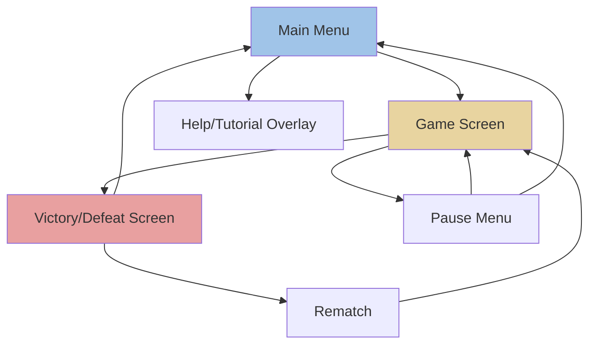
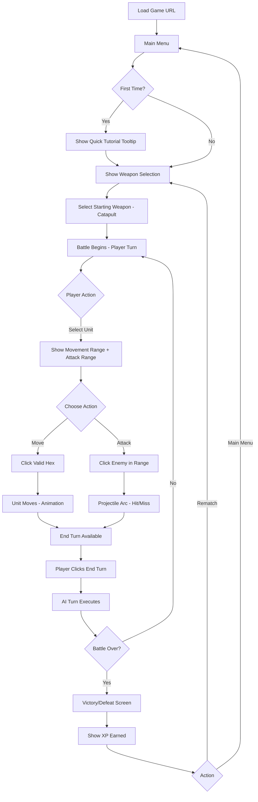
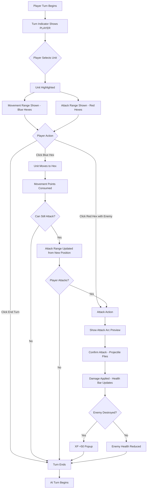
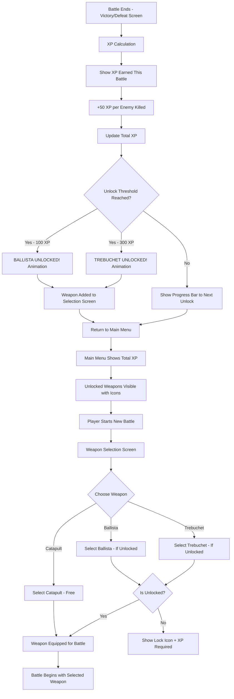

# Siege Tactics UI/UX Specification

**Version:** 1.0  
**Date:** November 21, 2025  
**Document Owner:** UX Expert (Sally)

---

## Introduction

This document defines the user experience goals, information architecture, user flows, and visual design specifications for **Siege Tactics**' user interface. It serves as the foundation for visual design and frontend development, ensuring a cohesive and user-centered experience.

### Overall UX Goals & Principles

#### Target User Personas

1. **Hackathon Judge** - Needs to quickly understand gameplay and evaluate innovation within 5-10 minutes
2. **Tactical Game Enthusiast** - Familiar with hex-grid games (Civ, XCOM), expects strategic depth and clear information
3. **Casual Strategy Player** - May be new to hex-grid tactics, needs intuitive onboarding and clear visual feedback

#### Usability Goals

- **Instant comprehension:** New players understand basic controls within 30 seconds
- **No hidden information:** All game state visible at appropriate times (ranges, movement, fog of war)
- **Tactile feedback:** Every action has immediate, satisfying visual/audio response
- **Quick sessions:** Complete match in 5-10 minutes with clear pacing

#### Design Principles

1. **Clarity over spectacle** - Game state must be instantly readable; visual effects enhance, never obscure
2. **Immediate feedback** - Every click, hover, and action provides instant visual response
3. **Progressive disclosure** - Show information when needed (ranges on hover, attack arcs on selection)
4. **Medieval authenticity** - Visual language should evoke siege warfare while staying pixel-art clear
5. **Respectful of player time** - No unnecessary clicks, animations complete quickly, info always accessible

### Change Log

| Date | Version | Description | Author |
|------|---------|-------------|--------|
| 2025-11-21 | 1.0 | Initial UX specification created | Sally (UX Expert) |

---

## Information Architecture (IA)

### Site Map / Screen Inventory

**Screen Breakdown:**
- **Main Menu:** Entry point with Start Game, Help, weapon unlock status
- **Game Screen:** Core gameplay - hex grid, unit controls, turn indicators, weapon info
- **Help/Tutorial Overlay:** Can be accessed anytime, explains controls and mechanics
- **Pause Menu:** Mid-game pause with resume/quit options
- **Victory/Defeat Screen:** End state with XP earned, unlocks achieved, rematch option

### Navigation Structure

**Primary Navigation:** Game is primarily modal - players move through distinct screens with clear transitions. No persistent navigation bar needed.

**Secondary Navigation:** 
- In-game UI elements (End Turn button, Pause button, weapon selector)
- Context actions appear on unit selection (Move, Attack options)

**Breadcrumb Strategy:** Not needed - game state always clear, limited screen depth (max 2 levels: Menu → Game or Game → Pause/Victory)

---

## User Flows

### Flow 1: First-Time Player Experience

**User Goal:** Understand the game and complete first battle

**Entry Points:** Landing on game URL, Main Menu "Start Battle"

**Success Criteria:** Player completes first match understanding basic movement, attack, and turn mechanics

#### Flow Diagram

#### Edge Cases & Error Handling:
- Player tries to move to invalid hex → Hex highlights red, tooltip shows "Invalid move"
- Player tries to attack out of range → Attack button disabled, range preview shows gap
- Player attempts action during AI turn → All interactions locked with "AI Thinking..." indicator
- Browser refresh mid-game → Game state lost, return to main menu (acceptable for MVP)

**Notes:** Tutorial should be skippable for judges/experienced players. First unit selection should auto-highlight to guide interaction.

---

### Flow 2: Core Combat Turn

**User Goal:** Execute tactical turn (move unit and/or attack enemy)

**Entry Points:** Player's turn begins (from game start or after AI turn)

**Success Criteria:** Player successfully positions unit and/or attacks, ending turn

#### Flow Diagram

#### Edge Cases & Error Handling:
- Unit selected but player clicks elsewhere → Deselect unit, clear range indicators
- Unit already moved but player tries to move again → Show "No movement remaining" message
- Attack kills enemy unlocking new weapon → Unlock notification queues for end-of-battle screen
- Fog of war hides enemy during attack → Attack fails with "Target lost in fog" message

**Notes:** Movement and attack can happen in either order if both are available. Visual feedback is critical for each state transition.

---

### Flow 3: XP Progression & Weapon Unlock

**User Goal:** Earn XP through battles and unlock new siege weapons

**Entry Points:** Any battle completion

**Success Criteria:** Player understands XP earned, progress toward unlocks, and can select unlocked weapons

#### Flow Diagram

#### Edge Cases & Error Handling:
- Player reaches 100 XP mid-battle → Queue unlock notification for end screen (don't interrupt gameplay)
- Multiple enemies killed in one turn → Calculate total XP, show aggregate (+100 XP)
- XP lost due to browser localStorage clear → Acceptable for MVP, consider server persistence later
- Player tries to select locked weapon → Weapon grayed out, tooltip shows "Unlock at X XP"

**Notes:** Unlock moments should feel rewarding - consider fanfare animation/sound. Progress bar motivates continued play.

---

## Wireframes & Mockups

**Primary Design Files:** Will be created in design tool (Figma/Sketch recommended) or implemented directly in code given 5-hour constraint

### Key Screen Layouts

#### Screen 1: Main Menu

**Purpose:** Entry point for game, shows progression status and launches battles

**Key Elements:**
- **Game Title** - "Siege Tactics" with medieval themed pixel art logo
- **Start Battle Button** - Large, prominent CTA
- **XP Display** - Current total XP with progress bar to next unlock
- **Weapon Arsenal Panel** - Shows all 3 weapons (Catapult/Ballista/Trebuchet) with unlock status
  - Unlocked weapons: Full color with stats preview on hover
  - Locked weapons: Grayed out with lock icon + "Unlock at X XP" label
- **Help/Tutorial Button** - Secondary button for game instructions
- **Background** - Medieval castle/battlefield pixel art scene

**Interaction Notes:** 
- Start Battle button should pulse slightly to draw attention
- Weapon cards clickable to preview stats even when locked
- XP progress bar animates on page load if XP was recently earned

**Design File Reference:** `main-menu.png` (to be created)

---

#### Screen 2: Game Screen (Core Battlefield)

**Purpose:** Primary gameplay interface where all tactical decisions occur

**Key Elements:**
- **Hex Grid Battlefield** - 15x15 hex grid, center-dominant in viewport (占 70% of screen space)
  - Individual hex tiles with terrain texture
  - Units rendered on hexes with pixel art sprites
  - Fog of war darkens unexplored/out-of-vision hexes
  - Range indicators overlay hexes (blue for movement, red for attack)
- **Top HUD Bar:**
  - Turn Indicator - "PLAYER TURN" / "AI TURN" with visual highlight
  - Current XP counter
  - Pause button (top right)
- **Bottom Action Panel:**
  - Selected unit info (weapon type, health bar, remaining actions)
  - Action buttons: "Move", "Attack", "End Turn"
  - Weapon stats tooltip (range, damage on hover)
- **Side Panel (Optional, if space):**
  - Mini-map showing full battlefield with fog overlay
  - Enemy unit count
- **Floating Tooltips:**
  - Hex coordinates on hover (for debugging, can be toggled off)
  - Damage preview when targeting attack

**Interaction Notes:**
- Hex tiles highlight on hover to show interactivity
- Unit selection shows pulsing border animation
- Range overlays fade in smoothly (0.2s transition)
- End Turn button changes color/pulses when no actions remaining
- All UI panels have semi-transparent backgrounds to not obstruct battlefield

**Design File Reference:** `game-screen-layout.png` (to be created)

---

#### Screen 3: Victory/Defeat Screen

**Purpose:** End-of-battle results showing outcome, XP earned, and next actions

**Key Elements:**
- **Result Banner** - Large "VICTORY!" or "DEFEAT" header with appropriate styling
  - Victory: Gold/yellow tones, triumphant graphic
  - Defeat: Red/gray tones, somber graphic
- **Battle Summary:**
  - Enemies destroyed count
  - Turns taken
  - XP earned this battle (+50 per kill)
- **XP Progress Section:**
  - Updated total XP
  - Progress bar showing advancement toward next unlock
  - Unlock notification if threshold reached ("NEW WEAPON UNLOCKED: Ballista!")
- **Action Buttons:**
  - "Rematch" - Start new battle immediately
  - "Main Menu" - Return to main menu
- **Background:** Blurred/dimmed version of final battlefield state

**Interaction Notes:**
- XP earned animates counting up from 0
- Unlock notification should have celebratory particle effect or fanfare
- Both buttons equally sized to avoid pressuring rematch

**Design File Reference:** `victory-defeat-screen.png` (to be created)

---

#### Screen 4: Help/Tutorial Overlay

**Purpose:** Teach game mechanics without interrupting flow

**Key Elements:**
- **Semi-transparent overlay** over current screen
- **Tutorial Content Panel** (centered, scrollable):
  - "How to Play" heading
  - **Movement:** "Click your unit, then click a blue hex to move"
  - **Attacking:** "Click an enemy in red range to attack"
  - **Fog of War:** Explanation with visual diagram
  - **Weapon Types:** Table showing Catapult/Ballista/Trebuchet stats
  - **Winning:** "Destroy all enemy units to win!"
- **Close Button** - X in top right corner
- **Optional:** Step-by-step interactive tutorial mode (P1 priority)

**Interaction Notes:**
- Overlay can be dismissed by clicking outside panel or pressing ESC
- Text should be concise with visual icons/diagrams
- Consider animated GIFs showing example moves

**Design File Reference:** `tutorial-overlay.png` (to be created)

---

## Component Library / Design System

**Design System Approach:** Custom lightweight component library tailored for medieval pixel art aesthetic. Given 5-hour constraint, focus on essential, reusable components rather than comprehensive design system. Components should be CSS-based where possible to minimize JavaScript overhead.

### Core Components

#### Component 1: Hex Tile

**Purpose:** Individual hexagon cell in battlefield grid, serves as foundation for all game interactions

**Variants:**
- Default (unexplored)
- Visible (within fog of war radius)
- Highlighted (hoverable/selectable)
- Movement range (blue overlay)
- Attack range (red overlay)
- Invalid (red outline for invalid moves)
- Occupied (contains unit)

**States:**
- Default
- Hover (subtle brightness increase)
- Selected (pulsing border)
- Disabled (during AI turn)

**Usage Guidelines:**
- Always show subtle grid lines to distinguish hex boundaries
- Transition between states smoothly (0.2s ease)
- Stack overlays (terrain → fog → range indicator → unit)
- Ensure sufficient contrast for accessibility even under fog of war

---

#### Component 2: Unit Sprite

**Purpose:** Visual representation of siege weapon units on battlefield

**Variants:**
- Catapult (player and AI versions)
- Ballista (player and AI versions)
- Trebuchet (player and AI versions)

**States:**
- Idle (default animation - subtle sway)
- Selected (highlighted border, status panel appears)
- Moving (transition animation between hexes)
- Attacking (firing animation with projectile)
- Taking damage (hit flash effect)
- Destroyed (death animation, remove from board)

**Usage Guidelines:**
- Pixel art sprites at 32x32 or 64x64 resolution
- Player units face right, AI units face left for clear identification
- Health bar always visible above unit (green → yellow → red gradient)
- Selection border should be 2px bright color distinct from terrain

---

#### Component 3: Action Button

**Purpose:** Primary interaction buttons for player actions (Move, Attack, End Turn, etc.)

**Variants:**
- Primary (End Turn, Start Battle)
- Secondary (Pause, Help)
- Destructive (Quit, Confirm Attack)

**States:**
- Default
- Hover (brightness +10%, scale 1.02)
- Active/Pressed (brightness -10%)
- Disabled (grayed out, cursor: not-allowed)
- Pulsing (for attention - End Turn when ready)

**Usage Guidelines:**
- Minimum size: 120px wide × 40px tall for accessibility
- Use medieval button styling (stone/wood texture with border)
- Icons + text for clarity
- Disabled state clearly communicated via grayscale filter

---

#### Component 4: Health Bar

**Purpose:** Display unit health status

**Variants:**
- Player unit (blue background)
- Enemy unit (red background)

**States:**
- Full (100% - green fill)
- Healthy (60-99% - yellow-green fill)
- Damaged (30-59% - yellow fill)
- Critical (1-29% - red fill with pulse)
- Empty (0% - unit destroyed)

**Usage Guidelines:**
- Always positioned directly above unit sprite
- Width: 48px, Height: 6px
- Include subtle drop shadow for visibility
- Animate health changes smoothly over 0.3s
- Show numeric value on hover (e.g., "45/100 HP")

---

#### Component 5: Progress Bar (XP)

**Purpose:** Show player progression toward weapon unlocks

**Variants:**
- Main menu (large, prominent)
- In-game HUD (compact)
- Victory screen (animated fill)

**States:**
- Default
- Filling (animated growth when XP earned)
- Complete (reached unlock threshold - gold glow)

**Usage Guidelines:**
- Always show current XP / next unlock XP as text
- Use gold/bronze color for medieval theme
- Include milestone markers at 100 XP and 300 XP
- Animate fill with easing curve (ease-out)

---

#### Component 6: Tooltip

**Purpose:** Provide contextual information on hover

**Variants:**
- Info tooltip (white background)
- Warning tooltip (yellow background)
- Error tooltip (red background)

**States:**
- Hidden (default)
- Visible (fade in 0.15s after 0.3s hover delay)
- Dismissed (fade out 0.1s)

**Usage Guidelines:**
- Position dynamically to stay within viewport
- Max width: 250px for readability
- Use clear, concise text (1-2 sentences max)
- Include arrow pointing to trigger element
- Font size: 14px for easy scanning

---

#### Component 7: Modal/Overlay

**Purpose:** Display full-screen contextual content (Tutorial, Pause Menu)

**Variants:**
- Tutorial overlay (help content)
- Pause menu (game options)
- Victory/Defeat screen (results)

**States:**
- Hidden
- Visible (fade in background dimmer + slide in content)
- Closing (reverse animation)

**Usage Guidelines:**
- Background overlay at 70% black opacity
- Content panel centered, max-width 600px
- ESC key and click-outside should dismiss (except victory screen)
- Include clear close button (X in top right)
- Trap focus within modal for accessibility

---

#### Component 8: Turn Indicator

**Purpose:** Clearly communicate whose turn it is

**Variants:**
- Player turn (blue/gold highlighting)
- AI turn (red/dark highlighting)

**States:**
- Active (bold, bright, possibly animated)
- Waiting (dimmed)

**Usage Guidelines:**
- Always visible in top HUD bar
- Use high contrast colors and large text (24px+)
- Consider subtle animation (pulse or glow) during active turn
- Include icon (player shield vs AI skull/flag)

---

## Branding & Style Guide

**Brand Guidelines:** No existing brand guidelines - creating new visual identity for Siege Tactics. Medieval siege warfare theme with pixel art aesthetic suitable for browser-based tactical game.

### Color Palette

| Color Type | Hex Code | Usage |
|------------|----------|-------|
| Primary | `#8B6F47` | UI backgrounds, medieval wood/stone textures |
| Secondary | `#4A7C9D` | Player elements, friendly indicators, movement ranges |
| Accent | `#D4AF37` | Gold highlights, XP rewards, victory elements |
| Success | `#5C8A3E` | Health bars (full), positive feedback, confirmations |
| Warning | `#E8A92E` | Health bars (damaged), caution indicators |
| Error | `#C24641` | Enemy elements, attack ranges, critical health, defeat |
| Neutral Dark | `#2C2416` | Text, borders, fog of war overlay |
| Neutral Mid | `#6B5D4F` | Secondary text, disabled states |
| Neutral Light | `#E8DCC8` | Backgrounds, paper textures, UI panels |
| Fog of War | `#1A1510` (opacity 70%) | Unexplored area overlay |

### Typography

#### Font Families

- **Primary:** `'Press Start 2P'` or similar pixel font for headings and UI elements (medieval + retro feel)
- **Secondary:** `'Courier New', monospace` for body text and stats (readable, retro-compatible)
- **Fallback:** System fonts for maximum compatibility

#### Type Scale

| Element | Size | Weight | Line Height |
|---------|------|--------|-------------|
| H1 (Screen Titles) | 32px | Bold | 1.2 |
| H2 (Section Headers) | 24px | Bold | 1.3 |
| H3 (Component Labels) | 18px | Bold | 1.4 |
| Body (UI Text) | 14px | Normal | 1.5 |
| Small (Tooltips, Stats) | 12px | Normal | 1.4 |

**Typography Notes:**
- Pixel fonts can be hard to read at small sizes - use sparingly for flavor
- Body text should use standard fonts for accessibility
- Ensure minimum 4.5:1 contrast ratio for all text

### Iconography

**Icon Library:** Custom pixel art icons (16x16 or 32x32) for game actions and UI elements

**Required Icons:**
- Weapons: Catapult, Ballista, Trebuchet sprites
- Actions: Move (boot icon), Attack (sword/crosshair), End Turn (hourglass)
- UI: Pause (||), Help (?), Close (X), Lock (padlock for locked weapons)
- Status: Shield (player), Skull/Flag (enemy), Heart (health), Star (XP)

**Usage Guidelines:**
- Maintain consistent pixel size across all icons
- Use 2-3 colors max per icon for clarity
- Ensure icons are recognizable even at small sizes
- Include text labels with icons for critical actions

### Spacing & Layout

**Grid System:** 8px base unit grid for consistent spacing

**Spacing Scale:**
- `xs`: 4px (tight internal padding)
- `sm`: 8px (component internal spacing)
- `md`: 16px (between related elements)
- `lg`: 24px (between sections)
- `xl`: 32px (major section gaps)
- `2xl`: 48px (screen margins)

**Layout Guidelines:**
- Use 16:9 aspect ratio for main game viewport (1280x720 baseline)
- Maintain 32px minimum margin from screen edges
- Hex grid should occupy 60-70% of screen space with UI surrounding
- Use flexbox/grid for responsive layouts
- Ensure UI elements don't obstruct battlefield view

### Visual Style Guidelines

**Pixel Art Standards:**
- Use nearest-neighbor scaling (no anti-aliasing on sprites)
- Consistent pixel density across all art assets
- Limited color palette (16-32 colors) for cohesive retro aesthetic
- Subtle dithering for gradients and shadows

**Texture & Patterns:**
- Stone/wood textures for UI backgrounds (medieval aesthetic)
- Parchment texture for modal overlays
- Hex grid subtle texture (grass, dirt, stone tiles)

**Animation Principles:**
- Keep animations snappy (under 300ms for UI)
- Use easing functions for natural feel (ease-out for appearing, ease-in for disappearing)
- Projectile arcs should follow parabolic curve
- Idle animations on units (subtle sway) for life

**Shadow & Depth:**
- Drop shadows on floating elements (tooltips, modals) for depth
- Hex tiles slightly raised appearance (bevel effect)
- Units cast subtle shadows on tiles

---

## Accessibility Requirements

**Compliance Target:** 

**Standard:** WCAG 2.1 Level AA compliance where feasible within hackathon constraints. Priority on keyboard navigation and visual accessibility.

### Key Requirements

**Visual:**
- **Color contrast ratios:** Minimum 4.5:1 for normal text, 3:1 for large text and UI components
  - Text on dark backgrounds (fog of war): Ensure white/light text maintains high contrast
  - Range indicators: Blue/red overlays must be distinguishable from terrain without relying solely on color
  - Health bars: Use both color AND position/icon to indicate status
- **Focus indicators:** 2px solid outline on all interactive elements when keyboard-focused
  - Use high-contrast color (yellow #FFD700 or white) that stands out against all backgrounds
  - Hex tiles, buttons, and units all receive visible focus state
- **Text sizing:** Minimum 14px for body text, 12px absolute minimum for small text
  - Pixel fonts only used for headings (larger sizes)
  - Allow browser zoom up to 200% without breaking layout

**Interaction:**
- **Keyboard navigation:** Full game playable without mouse
  - Tab/Shift+Tab to cycle through interactive elements
  - Arrow keys to navigate hex grid
  - Enter/Space to select unit or confirm action
  - Number keys (1-3) for quick action selection (Move/Attack/End Turn)
  - ESC to open pause menu or close overlays
- **Screen reader support:** Semantic HTML with ARIA labels where needed
  - Game state announced (e.g., "Player turn", "Enemy destroyed", "Victory")
  - Hex coordinates and unit info announced when focused
  - Turn indicators use aria-live regions for real-time updates
  - Not full narration (out of scope) but critical state changes announced
- **Touch targets:** Minimum 44x44px for all interactive elements (WCAG AAA)
  - Hex tiles may be smaller but grouped selections acceptable
  - Buttons, icons with click handlers meet minimum size

**Content:**
- **Alternative text:** All meaningful images have descriptive alt text
  - Unit sprites: "Catapult at position E7, 45 HP"
  - Weapon icons: "Ballista - Long-range precision siege weapon"
  - Decorative images marked as decorative (alt="")
- **Heading structure:** Logical H1→H2→H3 hierarchy for screen readers
  - H1: Screen title (Main Menu, Game Screen, Victory)
  - H2: Major sections (Battle Info, XP Progress)
  - H3: Component labels
- **Form labels:** All inputs properly labeled (if weapon selection uses form elements)
  - Radio buttons for weapon selection properly grouped
  - Submit buttons clearly labeled

### Testing Strategy

**Manual Testing:**
- Navigate entire game using only keyboard
- Test with browser zoom at 150% and 200%
- Test with reduced motion preference enabled (disable animations)
- Verify color contrast using browser DevTools contrast checker

**Automated Testing:**
- Run Lighthouse accessibility audit (target score 90+)
- Use axe DevTools to catch common ARIA/semantic issues
- Validate HTML for proper structure

**User Testing (if time permits):**
- Have one team member test with screen reader (NVDA/JAWS on Windows, VoiceOver on Mac)
- Test on touch device (tablet/phone) for touch target sizing

**Known Limitations (acceptable for MVP):**
- Full screen reader narration of all game events not feasible in 5 hours
- Animation reduction preferences may not disable all effects
- Color blindness modes (protanopia/deuteranopia support) deferred to post-MVP

---

## Responsiveness Strategy

Given Siege Tactics is a browser-based tactical game optimized for desktop play, responsiveness focuses on **supporting various desktop/laptop resolutions** with **limited mobile support** (mobile is stretch goal, not priority for 5-hour hackathon).

### Breakpoints

| Breakpoint | Min Width | Max Width | Target Devices |
|------------|-----------|-----------|----------------|
| Small Desktop | 1024px | 1279px | Smaller laptops, tablets in landscape |
| Standard Desktop | 1280px | 1919px | Most laptops and desktops (primary target) |
| Large Desktop | 1920px | 2559px | Full HD displays |
| Ultra-Wide | 2560px | - | 4K and ultra-wide monitors |

**Note:** Mobile breakpoints (320px-768px) are **deprioritized** for MVP. If implemented, mobile would show simplified view or "Best viewed on desktop" message.

### Adaptation Patterns

**Layout Changes:**

**Standard Desktop (1280px+):**
- Hex grid: 60-70% of viewport width, centered
- Side UI panels visible (unit info, mini-map if implemented)
- All features fully accessible
- Font sizes at base scale

**Small Desktop (1024-1279px):**
- Hex grid: 70-75% of viewport width
- Side panels collapse or overlay on interaction
- Slightly reduced padding/margins (24px → 16px)
- Font sizes maintained for readability

**Large Desktop (1920px+):**
- Hex grid scales proportionally but maintains max size ~1200px width
- Extra space used for wider margins and breathing room
- Option to show additional UI elements (detailed unit stats panel)
- Consider offering zoom controls for battlefield

**Ultra-Wide (2560px+):**
- Game remains centered with max-width ~1600px
- Background extends to fill space (medieval battlefield scenery)
- UI elements remain at comfortable sizes (no excessive scaling)

**Navigation Changes:**

- **1280px+:** All navigation elements visible simultaneously
- **1024-1279px:** Action panel may condense (icons + tooltips instead of text labels)
- **Mobile (if implemented):** Touch-optimized controls, swipe gestures considered

**Content Priority:**

**Always visible (all sizes):**
- Hex grid battlefield
- Current turn indicator
- Selected unit info
- Primary action buttons (Move, Attack, End Turn)

**Conditionally visible:**
- Mini-map: Hidden below 1280px
- Detailed weapon stats: Tooltip-only on smaller screens
- Background decorations: Reduced/hidden on small screens

**Interaction Changes:**

- **Desktop:** Mouse hover states, click interactions
- **Small Desktop:** Reduced hover effects, larger click targets
- **Touch (if supported):** 
  - Tap to select unit/hex
  - Long-press for additional info
  - Pinch to zoom on battlefield (stretch feature)

---

## Animation & Micro-interactions

**Motion Principles:**

1. **Purposeful Motion** - Every animation serves gameplay clarity or feedback, never decorative distraction
2. **Snappy Responsiveness** - UI animations complete in 150-300ms; gameplay animations slightly longer for clarity
3. **Easing for Realism** - Use natural easing curves (ease-out for appearing, ease-in for disappearing)
4. **Respect Preferences** - Honor `prefers-reduced-motion` by disabling decorative animations

### Key Animations

- **Hex Selection/Hover:** Hex brightens and scales slightly when hovered; pulses when selected (Duration: 150ms, Easing: ease-out)
- **Unit Movement:** Unit slides smoothly from origin hex to destination hex along path (Duration: 400ms per hex, Easing: ease-in-out)
- **Attack/Projectile Arc:** Projectile follows parabolic arc from attacker to target, target flashes on impact (Duration: 600-800ms, Easing: Custom cubic-bezier)
- **Health Bar Change:** Health bar smoothly drains/fills when damage taken; color transitions through gradient (Duration: 300ms, Easing: ease-out)
- **Unit Destruction:** Unit flashes red, explodes into particle fragments, fades out (Duration: 500ms, Easing: ease-in)
- **XP Gain Notification:** "+50 XP" floats up from destroyed enemy, fades out while rising (Duration: 800ms, Easing: ease-out)
- **Turn Transition:** Turn indicator flips/slides with color change (Duration: 250ms, Easing: ease-in-out)
- **Button Hover/Press:** Button brightens on hover (scale 1.02), darkens on press (scale 0.98) (Duration: 100ms hover, 50ms press, Easing: ease-out)
- **Modal/Overlay Appear:** Background dimmer fades in, content panel scales up from 0.9 to 1.0 (Duration: 250ms, Easing: ease-out)
- **Weapon Unlock Celebration:** Gold particles burst, weapon icon scales in with bounce, fanfare sound (Duration: 1200ms, Easing: Custom bounce)
- **Range Indicator Fade:** Blue/red hex overlays fade in when unit selected (Duration: 200ms, Easing: ease-in-out)
- **Fog of War Reveal:** Dark overlay fades out as unit moves into range (Duration: 400ms, Easing: ease-out)
- **End Turn Button Pulse:** Button glows/pulses when all actions complete (Duration: 1000ms loop, Easing: ease-in-out)
- **Victory/Defeat Banner:** Banner slides in from top with bounce or fade effect (Duration: 600ms, Easing: Custom bounce/ease-out)
- **Idle Unit Animation:** Subtle sway/bob on units when not in action (Duration: 2000ms loop, Easing: ease-in-out)

---

## Performance Considerations

### Performance Goals

- **Page Load:** Initial load complete within 2 seconds on standard broadband (5 Mbps+)
- **Interaction Response:** UI interactions (button clicks, unit selection) respond within 100ms
- **Animation FPS:** Maintain 60 FPS during gameplay animations (unit movement, projectile arcs)
- **Turn Processing:** AI turn calculation and execution complete within 1-2 seconds

### Design Strategies

**Asset Optimization:**
- **Pixel Art Sprites:** Export at 2x resolution for retina, keep file sizes under 50KB total for all sprites
- **Sprite Sheets:** Combine all unit/weapon sprites into single sprite sheet to reduce HTTP requests
- **Image Format:** Use PNG for pixel art (lossless), consider WebP with PNG fallback for broader assets
- **Lazy Loading:** Load victory/defeat screen assets only when needed (not on initial page load)

**Rendering Optimization:**
- **Canvas vs DOM:** Use HTML5 Canvas for hex grid rendering (better performance for 15x15 grid than 225 DOM elements)
- **Layer Promotion:** Use `will-change: transform` on animated elements (units, projectiles) for GPU acceleration
- **Requestanimationframe:** All animations use RAF for smooth 60fps, batched updates
- **Visibility Culling:** Only render hexes/units within visible viewport (if zooming implemented)

**Code Optimization:**
- **Minimal Dependencies:** Avoid heavy frameworks (React/Vue) for 5-hour project; use vanilla JS or lightweight library
- **Bundle Size:** Keep total JS bundle under 100KB (uncompressed), under 30KB gzipped
- **Code Splitting:** Separate game logic from UI code for potential lazy loading
- **Event Delegation:** Use event delegation for hex grid clicks (1 listener vs 225)

**State Management:**
- **Efficient Updates:** Only re-render changed elements, not entire battlefield on each action
- **LocalStorage:** XP/unlock data stored locally, minimal reads/writes (only on battle end)
- **Debouncing:** Hover effects debounced to avoid excessive recalculations

**AI Performance:**
- **Turn Time Budget:** AI pathfinding and decision-making limited to 500ms max
- **Simplify Algorithm:** A* pathfinding with limited search depth (5-6 hexes max)
- **Async Processing:** Run AI calculations in setTimeout to avoid blocking UI thread

**Fog of War Optimization:**
- **Pre-calculate Visibility:** Cache visible hex ranges for each position to avoid recalculating every turn
- **CSS Filters:** Use CSS opacity/blur for fog effect rather than redrawing tiles

**Animation Performance:**
- **CSS Transforms:** Prefer `transform: translate()` over `left/top` for 60fps
- **Reduce Particles:** Limit destruction particles to 10-15 (not 50+) for older devices
- **Stagger Animations:** If multiple units move, stagger slightly to spread CPU load

**Browser Compatibility:**
- **Target Chrome First:** Optimize for Chrome (hackathon judging environment)
- **Polyfills:** Minimal polyfills only if targeting older browsers (not priority)
- **Feature Detection:** Use Canvas API feature detection, fallback to static message if unsupported

---

