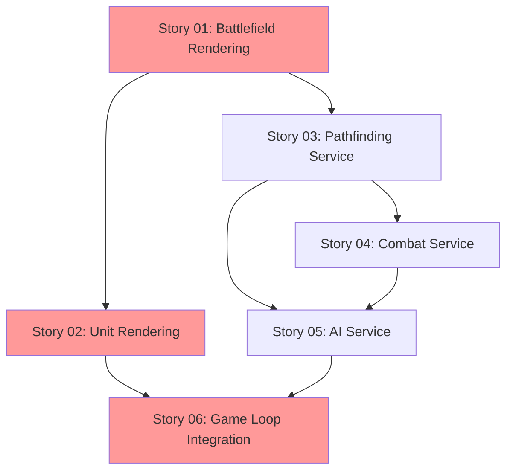

# Development Backlog Summary

**Project:** Siege Tactics - AI-Driven Hackathon '25  
**Created By:** Bob (Scrum Master)  
**Date:** November 21, 2025  
**Status:** Ready for Development

---

## Overview

This backlog contains **6 core development stories** to complete the MVP of Siege Tactics. All foundation work (architecture, data models, utilities) is complete. These stories focus on implementing the rendering, gameplay services, and integration layers.

**Total Estimated Effort:** 16 Story Points (~11-12 hours)  
**Current MVP Completion:** 40%  
**Remaining Work:** 60%

---

## Story Priorities & Dependencies

### Critical Path (Must Complete in Order)

**Parallel Development Possible:**
- Stories 01 & 03 can be developed simultaneously
- Stories 02, 03, 04, 05 can overlap (different developers)
- Story 06 requires all others complete

---

## Story Quick Reference

| ID | Title | Priority | Est. | Dependencies | Status |
|----|-------|----------|------|--------------|--------|
| SIEGE-001 | Battlefield Rendering System (2.5D) | P0 | 4 SP | None | ✅ Ready |
| SIEGE-002 | Unit Rendering | P0 | 2 SP | 001 | ✅ Ready |
| SIEGE-003 | Pathfinding Service | P0 | 3 SP | None | ✅ Ready |
| SIEGE-004 | Combat Service | P0 | 2 SP | 003 | ✅ Ready |
| SIEGE-005 | AI Service | P0 | 3 SP | 003, 004 | ✅ Ready |
| SIEGE-006 | Game Loop Integration | P0 | 2 SP | All | ✅ Ready |

**Total:** 16 Story Points

---

## Detailed Story Summaries

### Story 01: Battlefield Rendering System
**File:** `story-01-battlefield-rendering-system.md`  
**Priority:** P0 (Critical - Blocking)  
**Estimate:** 4 Story Points (~3 hours)

**What it does:**
- Implements 2.5D isometric Canvas-based hex grid rendering
- Creates BattlefieldRenderer.ts and Renderer.ts
- Displays 15x15 hexagonal battlefield with depth/elevation
- Integrates with GameEngine rendering pipeline
- Z-order depth sorting for proper layering

**Key Deliverables:**
- `src/rendering/BattlefieldRenderer.ts`
- `src/rendering/Renderer.ts`
- Visual output: Isometric hex grid with 3D appearance

**Blocks:** Story 02 (Unit Rendering)

---

### Story 02: Unit Rendering
**File:** `story-02-unit-rendering.md`  
**Priority:** P0 (Critical)  
**Estimate:** 2 Story Points (~1.5 hours)

**What it does:**
- Renders units as colored shapes (placeholder sprites)
- Displays health bars above units
- Shows selection highlighting
- Differentiates weapon types and player/AI units

**Key Deliverables:**
- `src/rendering/UnitRenderer.ts`
- Visual output: Units visible on battlefield

**Depends On:** Story 01  
**Blocks:** Story 06

---

### Story 03: Pathfinding Service
**File:** `story-03-pathfinding-service.md`  
**Priority:** P0 (Critical)  
**Estimate:** 3 Story Points (~2 hours)

**What it does:**
- Implements A* pathfinding for hex grid
- Calculates valid movement ranges
- Finds shortest paths between hexes
- Handles obstacle avoidance

**Key Deliverables:**
- `src/services/PathfindingService.ts`
- Movement calculation logic

**Blocks:** Stories 04, 05, 06

---

### Story 04: Combat Service
**File:** `story-04-combat-service.md`  
**Priority:** P0 (Critical)  
**Estimate:** 2 Story Points (~1.5 hours)

**What it does:**
- Calculates attack ranges per weapon type
- Executes damage application
- Handles unit destruction
- Implements turn action tracking

**Key Deliverables:**
- `src/services/CombatService.ts`
- Combat resolution logic

**Depends On:** Story 03  
**Blocks:** Stories 05, 06

---

### Story 05: AI Service
**File:** `story-05-ai-service.md`  
**Priority:** P0 (Critical)  
**Estimate:** 3 Story Points (~2 hours)

**What it does:**
- Implements basic tactical AI opponent
- AI movement toward player
- AI attack prioritization
- Turn management for AI

**Key Deliverables:**
- `src/services/AIService.ts`
- Playable AI opponent

**Depends On:** Stories 03, 04  
**Blocks:** Story 06

---

### Story 06: Game Loop Integration
**File:** `story-06-game-loop-integration.md`  
**Priority:** P0 (Critical)  
**Estimate:** 2 Story Points (~1.5 hours)

**What it does:**
- Canvas click detection to hex conversion
- User input handling (select, move, attack)
- Victory/defeat conditions
- Full game loop completion

**Key Deliverables:**
- Complete GameEngine integration
- Fully playable game

**Depends On:** Stories 01-05 (all)  
**Blocks:** None (final integration)

---

## Development Strategy

### Recommended Approach (Solo Developer)

**Phase 1: Visual Foundation (4-5 hours)**
1. Story 01: Battlefield Rendering - 2.5D Isometric (3 hours)
2. Story 02: Unit Rendering (1.5 hours)
3. **Checkpoint:** Verify units visible on isometric battlefield

**Phase 2: Game Logic (4-5 hours)**
4. Story 03: Pathfinding Service (2 hours)
5. Story 04: Combat Service (1.5 hours)
6. Story 05: AI Service (2 hours)
7. **Checkpoint:** Test services in console

**Phase 3: Integration (1.5-2 hours)**
8. Story 06: Game Loop Integration (1.5 hours)
9. **Checkpoint:** Full gameplay test

**Total Time:** ~11-12 hours

### Team Development (If Multiple Developers)

**Developer A (Frontend Focus):**
- Story 01: Battlefield Rendering
- Story 02: Unit Rendering
- Story 06: Game Loop Integration (UI parts)

**Developer B (Backend/Logic Focus):**
- Story 03: Pathfinding Service
- Story 04: Combat Service
- Story 05: AI Service
- Story 06: Game Loop Integration (logic parts)

**Parallel Timeline:** ~6-7 hours with proper coordination

---

## Testing Strategy

### After Each Story
- Manual console testing
- Visual verification (rendering stories)
- Performance check (60fps requirement)

### Integration Testing (After Story 06)
- Full gameplay walkthrough
- Victory/defeat scenarios
- Edge case validation
- Browser compatibility (Chrome minimum)

---

## Definition of "Done" for Backlog

- [ ] All 6 stories completed
- [ ] Game playable end-to-end
- [ ] No TypeScript compilation errors
- [ ] No runtime console errors
- [ ] Performance: 60fps maintained
- [ ] Victory/defeat conditions working
- [ ] AI opponent functional
- [ ] Ready for deployment

---

## Post-MVP Enhancements (Out of Scope)

These are **not included** in current stories but documented for future:

**Phase 2 Features:**
- Story 07: Fog of War Rendering
- Story 08: Projectile Animations
- Story 09: Sound Effects
- Story 10: Advanced AI Behaviors

**Phase 3 Features:**
- Multiplayer support (WebSocket)
- User accounts
- Leaderboards
- Additional weapon types

---

## Story Files Location

All stories located in: `docs/stories/`

- `story-01-battlefield-rendering-system.md`
- `story-02-unit-rendering.md`
- `story-03-pathfinding-service.md`
- `story-04-combat-service.md`
- `story-05-ai-service.md`
- `story-06-game-loop-integration.md`
- `backlog-summary.md` (this file)

---

## How to Use This Backlog

### For AI Developer Assistant

When user requests story implementation:

1. **Read the specific story file** (`story-XX-*.md`)
2. **Follow acceptance criteria** exactly as written
3. **Use code examples** provided in story
4. **Reference integration points** for existing code
5. **Test per testing instructions** in story
6. **Mark story complete** when all DoD items checked

### For Human Developer

1. **Start with Story 01** (or 03 if working parallel)
2. **Complete each story fully** before moving to next
3. **Test after each story** using instructions
4. **Check off DoD items** as you complete them
5. **Run integration tests** after Story 06
6. **Deploy** when all stories complete

---

## Questions or Issues?

If stories are unclear or require clarification:

1. Refer to `docs/architecture.md` for system design
2. Refer to `docs/prd.md` for requirements
3. Check `docs/IMPLEMENTATION-STATUS.md` for context
4. Consult with Scrum Master (Bob) for story refinement

---

**Status:** Complete Backlog Ready for Development 🚀  
**Next Action:** Begin Story 01 (Battlefield Rendering System)

---

**Created By:** Bob (Scrum Master)  
**Date:** November 21, 2025
